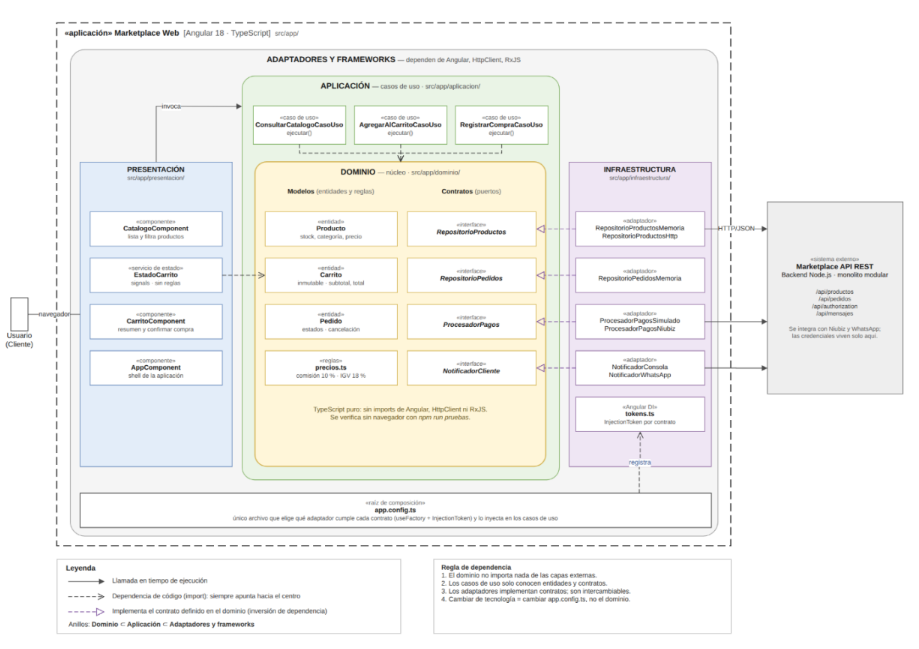

| Elemento | Descripción aplicada al Marketplace |
|---|---|
| **Patrón / enfoque arquitectónico** | Clean Architecture (Arquitectura Limpia). |
| **Objetivo** | Separar responsabilidades y controlar las dependencias hacia el dominio. |
| **¿Qué problema resuelve?** | Evita el acoplamiento entre la interfaz Angular, las reglas del negocio y las tecnologías externas, como bases de datos, API y servicios de pago. |
| **Capas definidas** | Presentación, Aplicación, Dominio e Infraestructura. |
| **Beneficios** | • Facilita el mantenimiento y las pruebas unitarias. • Permite cambiar implementaciones técnicas sin modificar innecesariamente las reglas del negocio. • Mejora la organización y separación de responsabilidades del código. |

## Diagrama del enfoque arquitectónico

## Descripción del enfoque arquitectónico

El sistema Marketplace adopta el enfoque arquitectónico **Clean Architecture (Arquitectura Limpia)**, cuyo objetivo es separar las responsabilidades del sistema y controlar las dependencias internas hacia el dominio.

Este enfoque organiza la aplicación en las capas de **Presentación, Aplicación, Dominio e Infraestructura**. La capa de Dominio contiene las reglas principales del negocio, mientras que la capa de Aplicación coordina los casos de uso. La Presentación gestiona la interacción con los usuarios y la Infraestructura contiene las implementaciones concretas relacionadas con APIs, persistencia y servicios externos.

Clean Architecture evita el acoplamiento directo entre la interfaz desarrollada con Angular, las reglas del negocio y tecnologías externas como bases de datos, APIs o servicios de pago. De esta manera, es posible cambiar implementaciones técnicas sin modificar innecesariamente las reglas centrales del negocio.

Este enfoque favorece la **mantenibilidad, las pruebas unitarias y la separación de responsabilidades**, permitiendo que el sistema pueda evolucionar con menor impacto entre sus componentes.