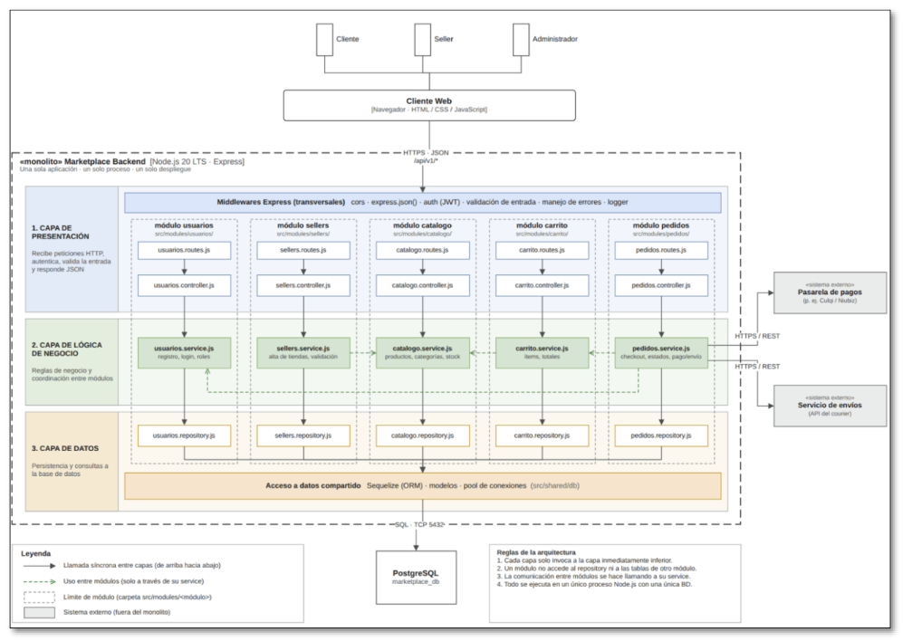

## Diagrama de arquitectura

## Descripción del estilo arquitectónico

El sistema Marketplace adopta un estilo arquitectónico **Monolito Modular**, en el cual las principales funcionalidades del negocio se organizan en módulos independientes dentro de una misma aplicación desplegable.

Los módulos principales son **Usuarios, Catálogo, Carrito, Pedidos y Pagos**. Cada uno agrupa responsabilidades relacionadas con una parte específica del negocio, permitiendo una mejor separación de funciones y facilitando el mantenimiento del sistema.

La aplicación web se comunica con el Marketplace mediante una **API REST**, mientras que los módulos internos acceden a los mecanismos de persistencia y, cuando es necesario, se integran con servicios externos como la **pasarela de pago** y el **servicio de envío**.

Este estilo permite mantener una arquitectura centralizada y sencilla de desplegar, pero con una organización modular que favorece la mantenibilidad y la evolución del sistema.

